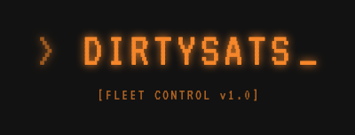

<p align="center">
  
</p>

<p align="center">
  <strong>Bitcoin Mining Fleet Manager</strong><br>
  <em>Stack sats, track stats</em>
</p>

<p align="center">
  
  
  
</p>

---

A production-ready Bitcoin mining fleet management dashboard for home-scale miners. Monitor, optimize, and manage your mining operation with real-time data, energy cost tracking, and profitability analysis.

## Features

### Fleet Management
- **Auto-Discovery**: Fast parallel network scanning finds all miners in 30-60 seconds
- **Multi-Miner Support**: Bitaxe, NerdQAxe, Antminer, Whatsminer, Avalon, and more
- **Real-Time Monitoring**: Live updates every 5 seconds with auto-refresh
- **Miner Groups**: Organize miners by location (Garage, Office, etc.)
- **Remote Control**: Restart miners, adjust frequency, control fan speeds
- **Custom Naming**: Rename miners for easy identification

### Energy & Profitability
- **Live Profitability**: Real-time profit/loss calculations based on your energy rates
- **Time-of-Use (TOU) Rates**: Support for peak/off-peak electricity pricing
- **OpenEI Integration**: Search and apply official utility rates from the OpenEI database
- **Energy Consumption Tracking**: Historical kWh usage with cost breakdowns
- **Break-Even Calculator**: See the BTC price needed to break even
- **Key Metrics**:
  - Sats/kWh (mining efficiency)
  - $/TH/day (hosting cost comparison)
  - J/TH (energy efficiency)

### Automated Mining Control
- **Peak Hour Management**: Automatically turn off or reduce power during expensive electricity
- **Off-Peak Optimization**: Run at maximum power when electricity is cheapest
- **Rate Threshold Override**: Emergency shutoff when rates exceed your limit
- **Visual Controls**: Easy radio-button interface with frequency sliders

### Strategy Optimizer
- Compare mining strategies based on your actual energy rates:
  - **Off-Peak Only**: Mine only during cheapest hours
  - **Conservative**: Turn off during peak, reduce otherwise
  - **24/7 Maximum**: Full power all day
  - **Smart Scheduling**: Reduce during peak, maximize during off-peak
- One-click apply for any strategy

### Charts & Analytics
- **Fleet Performance**: Combined hashrate and temperature over time
- **Power Consumption**: Historical power usage graphs
- **Profitability Trend**: Daily profit/loss visualization
- **Mining Efficiency**: J/TH tracking over time
- **Share Statistics**: Accepted vs rejected shares
- **Energy History**: kWh consumption with cost breakdown

### Alerts & Notifications
- **Telegram Integration**: Get alerts on your phone
- **Overheat Warnings**: Automatic notifications when miners run hot
- **Offline Detection**: Know immediately when a miner goes down
- **Auto-Recovery**: Automatic reboot when miners cool down after overheating

### Additional Features
- **Solo Mining Odds**: Calculate your chance of finding a block
- **Pool Configuration**: Manage mining pool settings per miner
- **Data Export**: Export miners, history, and profitability data (CSV/JSON)
- **Dark/Light Theme**: Toggle between visual modes
- **Mobile Responsive**: Works on phones and tablets
- **Lightning Donations**: Support development via Lightning Network

## Supported Miners

### ESP-Miner Devices (Full Support)
- **BitAxe** (Ultra, Supra, Gamma, Max)
- **NerdQAxe** / **NerdQAxe++**
- **NerdAxe**
- **Hex**
- Other ESP32-based miners

### CGMiner Devices (Monitoring)
- **Antminer** S9, S19, etc.
- **Whatsminer** M30, M50, etc.
- **Avalon** miners
- Any miner with CGMiner API on port 4028

## Requirements

- **Python 3.7+**
- **Local network** with miners
- **Optional**: OpenEI API key for utility rate lookup

## Quick Start

### Installation

```bash
git clone https://github.com/supremeshortty/home-mining-fleet-manager.git
cd home-mining-fleet-manager
pip install -r requirements.txt
```

### Running

```bash
python3 app.py
```

### Access Dashboard

Open your browser to: **http://localhost:5001**

Or from another device: **http://<your-ip>:5001**

## Configuration

Edit `config.py` to customize:

```python
# Network
NETWORK_SUBNET = "10.0.0.0/24"    # Your network subnet
DISCOVERY_TIMEOUT = 2             # Seconds per IP
DISCOVERY_THREADS = 20            # Parallel scan threads

# Monitoring
UPDATE_INTERVAL = 30              # Seconds between updates

# Flask
FLASK_HOST = "0.0.0.0"
FLASK_PORT = 5001

# Thermal Management
OVERHEAT_AUTO_REBOOT = True       # Auto-reboot after cooldown
OVERHEAT_RECOVERY_TEMP = 38       # Temperature to trigger reboot

# OpenEI (optional - for utility rate lookup)
OPENEI_API_KEY = "your-api-key"   # Get free key at openei.org
```

## Dashboard Tabs

### Fleet Tab
- Fleet statistics (miners, hashrate, shares, efficiency)
- Performance chart with hashrate and temperature
- Miner cards with live stats and controls
- Group filtering and selection mode

### Energy Tab
- **Utility Rate Configuration**: Search OpenEI or enter rates manually
- **Current Status**: Period indicator, current rate, energy/cost today
- **Energy Consumption History**: Bar chart with daily/weekly/monthly views
- **Profitability**: Complete breakdown with all key metrics
- **Rate Schedule**: View your configured TOU rates
- **Automated Mining Control**: Set up automatic frequency adjustments
- **Strategy Optimizer**: Compare and apply mining strategies

### Charts Tab
- Historical data visualization
- Multiple chart types with time range selectors
- Export functionality

### Alerts Tab
- Telegram bot configuration
- Alert history

### Pools Tab
- Mining pool management per miner

## API Endpoints

### Fleet Management
```
GET  /api/miners              # List all miners
GET  /api/stats               # Fleet statistics
POST /api/discover            # Scan network for miners
POST /api/miner/<ip>/restart  # Restart a miner
DELETE /api/miner/<ip>        # Remove a miner
```

### Energy & Profitability
```
GET  /api/energy/rates              # Current rate schedule
POST /api/energy/rates              # Apply rate preset
GET  /api/energy/profitability      # Current profitability
GET  /api/energy/consumption/actual # Actual energy consumption
```

### History & Analytics
```
GET /api/history/hashrate?hours=24    # Hashrate history
GET /api/history/temperature?hours=24 # Temperature history
GET /api/history/power?hours=24       # Power history
```

### Export
```
GET /api/export/miners?format=csv
GET /api/export/history?format=csv
GET /api/export/profitability?format=csv
```

## Architecture

```
DirtySats/
├── app.py                 # Flask app and FleetManager
├── config.py              # Configuration settings
├── database/
│   └── db.py              # SQLite operations
├── miners/
│   ├── base.py            # Abstract base class
│   ├── bitaxe.py          # ESP-Miner API handler
│   ├── cgminer.py         # CGMiner API handler
│   └── detector.py        # Auto-detection factory
├── energy/
│   ├── rates.py           # Energy rate management
│   ├── profitability.py   # Profit calculations
│   └── openei.py          # OpenEI API integration
├── alerts/
│   └── telegram.py        # Telegram notifications
├── templates/
│   └── dashboard.html     # Main dashboard template
└── static/
    ├── script.js          # Frontend JavaScript
    └── style.css          # Styling
```

## Troubleshooting

### No miners found
1. Verify network subnet in `config.py`
2. Check miners are powered on and connected
3. Try pinging miner IPs manually
4. Ensure no firewall blocking ports 80/4028

### Miner showing offline
1. Check physical connection
2. Verify miner web interface is accessible
3. Restart the miner
4. Check API is enabled (some miners require this)

### Energy rates not working
1. Get a free API key from [OpenEI](https://openei.org/services/api/signup)
2. Add key to `config.py` or environment variable
3. Or use manual rate entry instead

### Dashboard slow/unresponsive
1. Reduce number of miners polled
2. Increase UPDATE_INTERVAL in config
3. Check network latency to miners

## Contributing

Contributions welcome! Please:
1. Fork the repository
2. Create a feature branch
3. Submit a pull request

## License

MIT License - See LICENSE file

## Support Development

If DirtySats helps your mining operation, consider supporting development:

- **Lightning**: Via the Donate button in the dashboard
- **GitHub**: Star the repository

## Acknowledgments

Built for the home mining community. Special thanks to the BitAxe and open-source mining communities.

---

**DirtySats** - *Stack sats, track stats*
